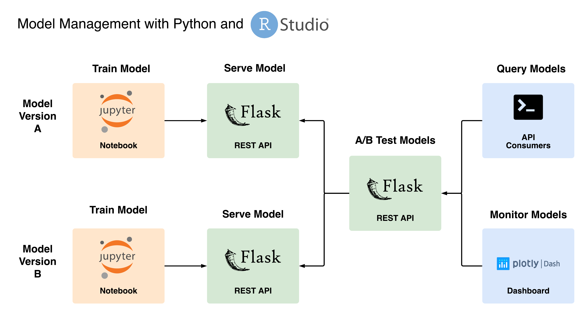

# Model Management with Python and RStudio

## Overview

These example projects demonstrate a full model lifecycle for different versions
of a model that were developed in Python and deployed to
[RStudio Connect](https://www.rstudio.com/products/connect/) using Jupyter
Notebooks, Flask, and Plotly Dash.

## Analysis

The data set used in this example involves demographic information and payment
history of various customers and whether they defaulted/missed a payment on
their credit accounts.

The example projects include:

* [Model A - Model Training Notebook](https://colorado.rstudio.com/rsc/model-management/-pythonmodel-a-train/) [[login]](https://colorado.rstudio.com/rsc/connect/#/apps/5177)
* [Model A - REST API Serving Model Predictions](https://colorado.rstudio.com/rsc/model-management-python/model-a-predict/) [[login]](https://colorado.rstudio.com/rsc/connect/#/apps/5182)
* [Model B - Model Training Notebook](https://colorado.rstudio.com/rsc/model-management-python/model-b-train/) [[login]](https://colorado.rstudio.com/rsc/connect/#/apps/5178)
* [Model B - REST API Serving Model Predictions](https://colorado.rstudio.com/rsc/model-management-python/model-b-predict/) [[login]](https://colorado.rstudio.com/rsc/connect/#/apps/5183)
* [REST API Traffic Router for A/B Testing](https://colorado.rstudio.com/rsc/model-management-python/model-router/) [[login]](https://colorado.rstudio.com/rsc/connect/#/apps/5184)
* [Interactive App to Query and Verify Model Results](https://colorado.rstudio.com/rsc/model-management-python/model-dashboard/) [[login]](https://colorado.rstudio.com/rsc/connect/#/apps/5217)

## RStudio Professional Products

RStudio Server Pro can be used with Jupyter Notebooks and machine learning
packages to develop, train, and score models during development. RStudio Connect
can be used to deploy models and API routers as REST APIs and host published
notebooks with details on model training.

## Documentation

The full example is documented at
https://solutions.rstudio.com/model-management-python/overview/.
